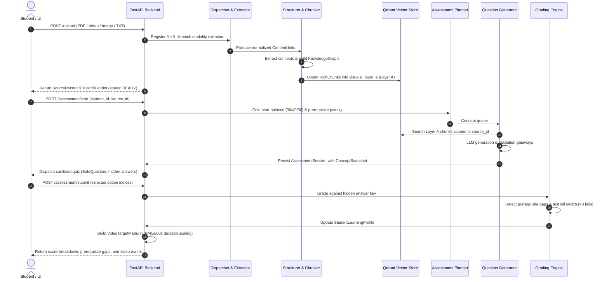

# ARCHITECTURE.md — VisualAI Platform Architecture

## 1. Complete Directory Architecture

```text
AI-VIDEO-GENERATOR/
├── .env                                 # Local environment variables & secrets
├── .env.example                         # Example environment configuration
├── .gitignore                           # Git ignore rules (caches, storage, .venv)
├── COMMANDS.md                          # Windows/PowerShell execution commands guide
├── DATA_FLOW.md                         # Step-by-step ingestion data flow documentation
├── Dockerfile                           # Production Docker image build definition
├── docker-compose.yml                   # Compose definition for VisualAI API & Qdrant
├── Makefile                             # Cross-platform development tasks
├── README.md                            # High-level Step 1 architectural overview
├── STEP1_STEP2_DATA_FLOW_AND_STORAGE.txt# In-depth technical specification for Steps 1 & 2
├── STEP2_SPECIFICATION.md               # Step 2 Assessment & Profiling specification
├── requirements.txt                     # Pinned Python package dependencies
├── start.bat                            # Windows one-click launcher
├── start.sh                             # Linux/macOS launcher
├── test_step1.py                        # Automated verification for Step 1 ingestion
├── test_step2.py                        # Master verification for Step 2 flow
├── test_step2_backfill.py               # Phase 2A question backfilling tests
├── test_step2_phase2b.py                # Phase 2B self-contained session snapshot tests
├── test_step2_phase2c.py                # Phase 2C config & stable concept ID tests
├── test_step2_phase3.py                 # Phase 3 LLM provider abstraction tests
├── test_step2_phase4.py                 # Phase 4 production hardening test suite
│
├── app/                                 # Main application package
│   ├── __init__.py
│   ├── main.py                          # FastAPI app entry point & top-level endpoints
│   │
│   ├── api/                             # REST API routers
│   │   ├── __init__.py
│   │   ├── dashboard.py                 # Embedded single-page Web console UI
│   │   ├── upload.py                    # POST /upload (Step 1 Ingestion endpoint)
│   │   └── assessment.py                # Step 2 assessment, submission & video target endpoints
│   │
│   ├── core/                            # Core application settings
│   │   ├── __init__.py
│   │   └── config.py                    # Environment settings, path resolvers, constants
│   │
│   ├── db/                              # Database and vector storage
│   │   ├── __init__.py
│   │   └── vector_store.py              # Qdrant client, Gemini embeddings, payload upsert
│   │
│   └── services/                        # Business logic & pipeline engines
│       ├── __init__.py
│       ├── schemas.py                   # Canonical models: ContentUnit, KnowledgeGraph, RichChunk
│       ├── registry.py                  # File validation, SHA-256, versioning, disk registry
│       ├── dispatcher.py                # Modality router (PDF, Image, Text, Video)
│       ├── extractor.py                 # PyMuPDF PDF parser & diagram image extractor
│       ├── vision.py                    # Gemini Vision wrappers for diagrams and frames
│       ├── structurer.py                # Concept & prerequisite extractor, TopicBlueprint builder
│       ├── chunker.py                   # Semantic concept-aware chunker for Qdrant Layer A
│       ├── validator.py                 # 5-stage ingestion quality validation gateway
│       │
│       ├── assessment/                  # Step 2 Assessment & Profiling Engine
│       │   ├── __init__.py
│       │   ├── schemas.py               # Step 2 Pydantic models (Questions, Sessions, Profiles, Targets)
│       │   ├── session_store.py         # JSON storage for assessment sessions
│       │   ├── planner.py               # Cold-start & adaptive concept selector, prereq pairing
│       │   ├── generator.py             # Grounded question generator with provenance tracking
│       │   ├── providers.py             # LLM provider protocol: Gemini, Ollama, Mock
│       │   ├── validator.py             # Question structure, grounding overlap, deduplication gateways
│       │   ├── engine.py                # Grading, anti-loop kill switch, prerequisite gaps
│       │   ├── profile.py               # StudentLearningProfile persistence
│       │   └── video_target.py          # VideoTargetMatrix builder (30s/45s/60s duration scaling)
│       │
│       └── video/                       # Video Matrix Ingestion Subsystem
│           ├── __init__.py
│           ├── pipeline.py              # Video processing orchestrator
│           ├── av_splitter.py           # FFmpeg audio separator (16kHz mono WAV)
│           ├── transcriber.py           # Faster-whisper ASR with timestamps
│           ├── frame_extractor.py       # OpenCV keyframe sampler & perceptual deduplication
│           └── fusion.py                # Multimodal fusion of speech + visuals into ContentUnits
│
└── storage/                             # Persistent runtime data directory
    ├── uploads/                         # Ephemeral staging & source files ({source_id}/original.<ext>)
    ├── processed/                       # Audio extraction & cached intermediate artifacts
    ├── registry/                        # Master catalog (sources_index.json) and per-source data
    │   ├── sources_index.json
    │   └── <source_id>/
    │       ├── content_units.json
    │       └── knowledge_graph.json
    ├── qdrant/                          # Primary embedded local vector DB storage
    ├── qdrant_local/                    # Secondary embedded storage for local testing
    ├── qdrant_storage/                  # Docker volume mount point for containerized Qdrant
    ├── assessment_sessions/             # Saved quiz sessions (<session_id>.json)
    ├── learning_profiles/               # Persistent student profiles (<student_id>_<source_id>.json)
    ├── video_targets/                   # Step 2 -> Step 3 handoff artifacts (<student_id>_<source_id>.json)
    └── test_scratch/                    # Temporary scratch files created during test runs
```

---

## 2. Frontend Architecture
The current frontend is implemented as an **embedded Single-Page Application (SPA)** delivered directly by FastAPI from [app/api/dashboard.py](file:///d:/ai%20video%20generator/AI-VIDEO-GENERATOR/app/api/dashboard.py) at `GET /`.

### Characteristics
- **Zero Build Tooling**: No node_modules, Webpack, or Vite dependency; renders immediately without compilation.
- **Tech Stack**: HTML5, Vanilla CSS3 (modern GitHub dark theme with slate and accent colors), and native Vanilla JavaScript (ES6+).
- **Responsive Layout**: CSS Grid and Flexbox with sticky navigation and mobile-friendly media queries.
- **Core Views**:
  1. **Generate Quiz**: Dropdown selector of ingested ready sources, student ID configuration, question count slider, dynamic quiz taker with hidden answer keys, submission scoring, and prerequisite gap visualization.
  2. **Direct Ingestion / Upload**: File drag-and-drop zone supporting `.pdf`, `.png`, `.jpg`, `.txt`, `.mp4`, `.mov`, `.mkv`, upload progress, and immediate Knowledge Graph blueprint visualization.
  3. **Learning Profiles**: Real-time inspection of student mastery scores, strong concepts, weak concepts, and prerequisite failure chains.
  4. **Video Target Matrix**: Inspection of the generated Step 3 handoff blueprint showing required video durations (30s/45s/60s) and human-intervention alerts.
  5. **Pipeline Documentation**: Interactive visual architecture diagrams and API endpoint reference.

---

## 3. Backend Architecture
The backend is built with **FastAPI** running asynchronously on **Uvicorn**:

```mermaid
graph TD
    Client[Web Browser / API Client] -->|HTTP / JSON| FastAPI[FastAPI Application (app.main:app)]
    FastAPI --> DashboardRouter[Dashboard Router (/)]
    FastAPI --> UploadRouter[Upload Router (/upload)]
    FastAPI --> AssessmentRouter[Assessment Router (/assessment)]
    
    UploadRouter --> Dispatcher[Modality Dispatcher]
    Dispatcher --> ExtractorPDF[PyMuPDF Extractor]
    Dispatcher --> ExtractorImg[Gemini Vision Extractor]
    Dispatcher --> ExtractorTxt[Plain Text Extractor]
    Dispatcher --> ExtractorVid[Video Matrix Pipeline]
    
    ExtractorPDF --> Structurer[Knowledge Structurer]
    ExtractorImg --> Structurer
    ExtractorTxt --> Structurer
    ExtractorVid --> Structurer
    
    Structurer --> KnowledgeGraph[Knowledge Graph & Topic Blueprint]
    Structurer --> Chunker[Semantic Chunker]
    Chunker --> VectorStore[Qdrant Layer A Sync]
    
    AssessmentRouter --> Planner[Assessment Planner]
    Planner --> Generator[Question Generator]
    Generator --> VectorStore
    Generator --> LLMProvider[LLM Provider (Gemini / Ollama / Mock)]
    Generator --> Validator[Question Validator & Dedupe]
    
    AssessmentRouter --> Engine[Grading & Kill Switch Engine]
    Engine --> ProfileStore[Learning Profile Persistence]
    Engine --> VideoTarget[Video Target Matrix Generator]
```

### Architectural Principles
- **Decoupled Modality Extractors**: The ingestion pipeline treats PDFs, images, text, and videos as pluggable providers that all converge into the canonical `ContentUnit` abstraction.
- **Layer A Strict Provenance**: All knowledge chunks synced to Qdrant are tagged with `"layer": "A"`. Raw original documents are considered immutable ground truth.
- **Resilient Fallbacks**: If external cloud APIs (Gemini) hit rate limits or 429 quota exhaustion, both Step 1 (heuristic structurer) and Step 2 (grounded template generation) gracefully degrade to rule-based execution without crashing.
- **Stateless API, File-Backed Persistence**: API endpoints are stateless, storing session states, source registries, and student profiles in persistent structured JSON on disk.

---

## 4. API Architecture & Routes

| Method | Route | Tag | Purpose |
|---|---|---|---|
| `GET` | `/` | Dashboard | Serves the interactive Web console SPA |
| `GET` | `/health` | System | Health check returning status, version, and active pipeline stages |
| `GET` | `/sources` | System | Lists all registered sources with status, modality, and concept counts |
| `GET` | `/debug/qdrant` | System | Diagnostics on Qdrant collection point counts and sample payloads |
| `POST` | `/upload` | Step 1 Ingestion | Ingests PDF/Image/TXT/Video, builds Knowledge Graph, indexes in Qdrant, returns blueprint |
| `POST` | `/assessment/start` | Step 2 Assessment | Initializes quiz session, plans concepts, generates grounded questions, returns sanitized quiz |
| `POST` | `/assessment/handoff` | Step 2 Assessment | Pipeline handoff alias accepting Step 1 output directly |
| `POST` | `/assessment/submit` | Step 2 Assessment | Grades answers, checks kill switch, updates profile, generates Video Target Matrix |
| `GET` | `/assessment/profile/{student_id}/{source_id}` | Step 2 Assessment | Retrieves persistent student learning profile |
| `GET` | `/assessment/status/{session_id}` | Step 2 Assessment | Checks status, question count, and timestamps of a quiz session |
| `GET` | `/assessment/video-target/{student_id}/{source_id}` | Step 2 Assessment | Handoff endpoint returning the Step 3 Video Target Matrix |

---

## 5. AI / LLM Pipeline

The AI pipeline is managed through an extensible provider abstraction ([app/services/assessment/providers.py](file:///d:/ai%20video%20generator/AI-VIDEO-GENERATOR/app/services/assessment/providers.py)):

### 1. Ingestion AI Pipeline
- **Vision Models**:
  - `describe_image`: Uses Gemini Vision to parse textbook figures, equations, and diagrams.
  - `describe_frame`: Uses Gemini Vision to transcribe blackboard handwriting, slides, and speaker demonstrations in lecture videos.
- **Structuring LLM**:
  - `process_structure_and_concepts`: Prompts Gemini (`gemini-3.5-flash`) with all normalized ContentUnits to extract structural hierarchy (Chapters, Sections) and semantic concepts with explicit prerequisite links.
  - **Heuristic Rule-Based Fallback**: If Gemini fails or hits 429 quota exhaustion, a regex-based syntactic parser extracts definitions, acronyms, and headings directly from text blocks so concepts are never empty.

### 2. Assessment AI Pipeline
- **Grounded Question Prompting**:
  - Prompt strictly constrains the model: *"Based ONLY on this text, generate a multiple-choice question. Provide exactly 1 correct answer and 3 plausible but factually incorrect options."*
  - Injects authoritative text chunks retrieved from Qdrant Layer A.
- **Provider Protocol**:
  - `GeminiProvider`: Connects to Google Generative AI API using `gemini-3.5-flash`.
  - `OllamaProvider`: Native HTTP adapter targeting local instances (e.g. `http://localhost:11434/api/generate` running `llama3.2`).
  - `MockProvider`: Offline, deterministic provider for fast unit tests without network access or API keys.
- **Quality Gateways**:
  - **Grounding Gateway**: Checks vocabulary overlap between question stems/options and source chunks, rejecting hallucinated questions.
  - **Duplicate Gateway**: Measures stem Jaccard similarity and option set overlap to prevent repeated questions.
  - **Deterministic Grounded Fallback**: Uses MD5 hash of concept IDs to deterministically place correct answers across options [0, 1, 2, 3] and generates domain-specific distractors using prerequisite links.

---

## 6. Video Pipeline: Ingestion vs Generation

### Current State (Step 1: Video Ingestion — Complete)
The video ingestion subsystem ([app/services/video/](file:///d:/ai%20video%20generator/AI-VIDEO-GENERATOR/app/services/video/)) converts video lectures into authoritative text and visual representations:
1. **Audio Separation**: [av_splitter.py](file:///d:/ai%20video%20generator/AI-VIDEO-GENERATOR/app/services/video/av_splitter.py) runs FFmpeg to extract 16kHz mono WAV.
2. **Speech Transcription**: [transcriber.py](file:///d:/ai%20video%20generator/AI-VIDEO-GENERATOR/app/services/video/transcriber.py) runs faster-whisper on CPU to produce timestamped segments and filters Whisper hallucinations.
3. **Keyframe Sampling & Deduplication**: [frame_extractor.py](file:///d:/ai%20video%20generator/AI-VIDEO-GENERATOR/app/services/video/frame_extractor.py) samples video frames every 12 seconds via OpenCV, deduping near-identical frames using 32x32 grayscale thumbnail comparison (<4% pixel shift skipped).
4. **Visual Description**: Kept keyframes are analyzed by Gemini Vision.
5. **Multimodal Fusion**: [fusion.py](file:///d:/ai%20video%20generator/AI-VIDEO-GENERATOR/app/services/video/fusion.py) matches spoken audio segments with keyframe descriptions within a 2-second jitter tolerance into unified `ContentUnit` records.

### Upcoming State (Step 3: Targeted AI Video Generation — Pending)
The output of Step 2 is the **Video Target Matrix** ([storage/video_targets/](file:///d:/ai%20video%20generator/AI-VIDEO-GENERATOR/storage/video_targets/)), which defines the exact specification for Step 3:
- **Duration Scaling by Conceptual Depth**:
  - **Foundational Concepts**: 30 seconds.
  - **Intermediate Concepts**: 45 seconds.
  - **Advanced Concepts**: 60 seconds.
- **Grounded Visual Provenance**: Contains chunk IDs, page numbers, and source content IDs so the video generation engine can pull original diagrams and textbook illustrations.
- **Exclusion of Kill-Switch Concepts**: Concepts flagged with `REQUIRES_HUMAN_FALLBACK` are excluded from video generation queues to prevent infinite loops on concepts requiring human instructor assistance.

---

## 7. Data & Storage Architecture

```mermaid
graph LR
    subgraph Storage [storage/]
        uploads[uploads/ <br/> Ephemeral staging & {source_id}/original]
        processed[processed/ <br/> Audio tracks & intermediate cache]
        registry[registry/ <br/> sources_index.json & {source_id}/]
        qdrant[qdrant/ & qdrant_local/ <br/> Embedded vector collections]
        sessions[assessment_sessions/ <br/> Active & completed quizzes]
        profiles[learning_profiles/ <br/> Persistent Student Profiles]
        targets[video_targets/ <br/> Step 3 Video Target Matrices]
    end
```

### Storage Directory Mapping
- `storage/uploads/{source_id}/original.<ext>`: Preserved original uploaded files.
- `storage/registry/sources_index.json`: Master index tracking file checksums, source IDs, versions, and statuses.
- `storage/registry/{source_id}/content_units.json`: Extracted canonical units with bounding boxes and sequence indices.
- `storage/registry/{source_id}/knowledge_graph.json`: Concepts, definitions, and prerequisite dependency networks.
- `storage/assessment_sessions/{session_id}.json`: Complete quiz sessions including question objects, hidden answer keys, and concept snapshots.
- `storage/learning_profiles/{student_id}_{source_id}.json`: Cumulative student scores, strong/weak concept lists, iteration counts, and prerequisite gaps.
- `storage/video_targets/{student_id}_{source_id}.json`: Generated remedial video blueprints for Step 3.

---

## 8. Database Architecture & Vector Models

### Qdrant Vector Collection: `visualai_layer_a`
- **Distance Metric**: Cosine similarity.
- **Vector Dimension**: Determined dynamically by embedding probe (typically 768 or 1536 dimensions via `gemini-embedding-2`).
- **Point ID Formulation**: Deterministic UUIDv5 based on DNS namespace:
  `uuid5(NAMESPACE_DNS, f"{source_id}::{chunk_id}::{text[:100]}")`
  *Guarantee: Re-indexing the same source updates points idempotently without ballooning vector storage.*
- **Payload Schema (`RichChunk`)**:
  ```json
  {
    "chunk_id": "CHUNK_f6366421aaae",
    "source_id": "SRC_63d54087dc2e",
    "asset_id": "AST_c9e1b20e3a93",
    "layer": "A",
    "type": "rich_chunk",
    "text": "Extracted authoritative source text...",
    "modality": "pdf",
    "chapter": "Classical Mechanics",
    "section": "Newton's Laws",
    "concept_ids": ["CONCEPT_FORCE", "CONCEPT_INERTIA"],
    "content_ids": ["CU_d8ec3544007b"],
    "page_start": 1,
    "page_end": 2,
    "timestamp_start": null,
    "timestamp_end": null,
    "extraction_method": "pymupdf_block"
  }
  ```

---

## 9. Authentication & Authorization Flow
- **Current State**: VisualAI currently operates in **single-tenant development mode**.
- **Student Identity**: Identifiers are resolved via request bodies or query parameters (e.g. `student_id="student_default"`).
- **Session Protection**:
  - Quiz answer keys are strictly withheld from client delivery through the `SafeQuestion` model.
  - Sessions enforce expiration via `expires_at` timestamps (default: 24 hours), rejecting late submissions with HTTP 410 Gone.
  - Submissions are locked once graded; resubmission attempts return HTTP 409 Conflict.
- **Production Roadmap**: Future multi-tenancy will introduce JWT authentication, user registration, role-based access (student vs instructor), and tenant-scoped storage.

---

## 10. Background Processing & Concurrency
- **Synchronous vs Asynchronous Handling**:
  - Fast extractions (TXT, small PDFs, images) run synchronously within FastAPI request handlers.
  - Large video files are processed via subprocess calls to FFmpeg and native OpenCV loops.
- **Self-Contained Session Snapshots**:
  - During quiz generation, a `ConceptSnapshot` dictionary is embedded inside the `AssessmentSession`.
  - When grading submissions, the engine can evaluate prerequisite gaps and classify difficulty even if disk registry files or Qdrant connections are temporarily unavailable.

---

## 11. External Services & Dependencies
1. **Google Gemini API**:
   - `gemini-3.5-flash`: Structure detection, concept extraction, question generation, and vision analysis.
   - `gemini-embedding-2`: Vector embeddings for Qdrant storage.
2. **Qdrant Vector Database**:
   - Primary vector engine running on `http://localhost:6333` (Docker) or embedded on disk.
3. **FFmpeg**:
   - System-level media transcriber for ripping video audio tracks.
4. **Ollama (Optional)**:
   - Local LLM execution endpoint on `http://localhost:11434`.

---

## 12. End-to-End Request & Data Flow


