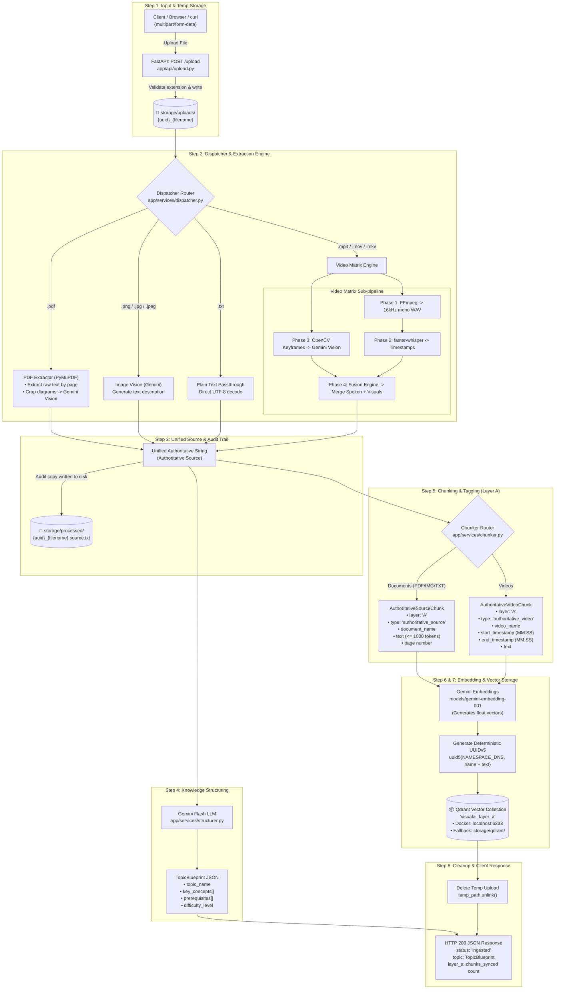

# VisualAI — Step-by-Step Data Flow Architecture

This document tracks **exactly where your data enters, how it transforms, what files are written to disk, and where it gets stored in the vector database.**

---

## 🗺️ Master Data Flowchart



---

## 🔍 Detailed Step-by-Step Data Journey

### Step 1: Entry & Temporary Disk Buffering
- **Source:** Client submits `multipart/form-data` to `POST /upload`.
- **Validation:** Checked against `ALLOWED_EXTENSIONS` (`pdf, png, jpg, jpeg, txt, mp4, mov, mkv`).
- **Disk Path:** Written to `storage/uploads/{uuid}_{original_filename}`.
- **Why:** Gives the extraction engines (PyMuPDF, FFmpeg, OpenCV) a real file handle on disk.

---

### Step 2: Media Routing & Content Extraction

Depending on file type, the file is routed by `app/services/dispatcher.py`:

| Extension | Pipeline Component | What it Extracts / Generates |
|---|---|---|
| **`.pdf`** | `app/services/extractor.py` (PyMuPDF) | Text on every page + crops embedded diagram images, passes diagrams to Gemini Vision, outputs unified text with `--- PAGE X ---` markers. |
| **`.png / .jpg / .jpeg`** | `app/services/vision.py` (Gemini Vision) | Converts visual image/diagram into rich semantic text description. |
| **`.txt`** | Direct passthrough | Reads UTF-8 raw text. |
| **`.mp4 / .mov / .mkv`** | `app/services/video/` (Video Matrix) | **Audio:** FFmpeg splits 16kHz mono WAV & faster-whisper outputs timestamped transcript.<br>**Video:** OpenCV samples keyframes every 12s, filters duplicates (<4% diff), Gemini Vision describes visuals.<br>**Fusion:** Merges speech and visuals chronologically into time blocks (e.g. `[01:15 - 01:30] Spoken: "..." \| Visible: "..."`). |

---

### Step 3: Raw Authoritative Text Persistence (Audit Trail)
- **Data Shape:** Single continuous string containing full transcribed/extracted ground truth.
- **Disk Path:** Saved to `storage/processed/{uuid}_{filename}.source.txt`.
- **Purpose:** Audit log, caching, and debugging of ground-truth source before any chunking.

---

### Step 4: Knowledge Structuring (LLM)
- **Input:** The authoritative text from Step 3.
- **Engine:** Gemini 2.5 Flash (`app/services/structurer.py`).
- **Data Output:** Strict Pydantic model (`TopicBlueprint`):
  ```json
  {
    "topic_name": "Thermodynamics: The Carnot Cycle",
    "key_concepts": ["Entropy", "Adiabatic expansion", "Thermal efficiency"],
    "prerequisites": ["First Law of Thermodynamics", "Ideal Gas Law"],
    "difficulty_level": "intermediate"
  }
  ```

---

### Step 5: Recursive Chunking & Layer A Tagging
- **Engine:** `app/services/chunker.py` using `RecursiveCharacterTextSplitter` (1000 tokens, 150 token overlap).
- **Tagged Schemas (`app/services/schemas.py`):**

#### Document Chunk (PDF / TXT / Images):
```json
{
  "layer": "A",
  "type": "authoritative_source",
  "document_name": "lecture_notes.pdf",
  "page": 3,
  "text": "..."
}
```

#### Video Chunk:
```json
{
  "layer": "A",
  "type": "authoritative_video",
  "video_name": "lecture.mp4",
  "start_timestamp": "02:15",
  "end_timestamp": "02:45",
  "text": "[02:15 - 02:45] Spoken: ... | Visible on screen: ..."
}
```

---

### Step 6: Embedding Generation
- **Engine:** Gemini Embeddings (`models/gemini-embedding-001`).
- **Transformation:** Each chunk's `.text` string is converted into a high-dimensional dense float vector (768 or 1536 dimensions).

---

### Step 7: Deterministic Point ID & Qdrant Upsert
- **Point ID:** Deterministic `uuid5(NAMESPACE_DNS, f"{doc_or_video_name}::{chunk_text[:200]}")`.
  - *Guarantees idempotency:* Re-uploading the same file updates existing points without duplicating.
- **Storage Target:**
  - **Docker Mode:** `http://localhost:6333` in collection `visualai_layer_a`.
  - **Embedded Fallback:** On disk at `storage/qdrant/`.
- **Payload stored in Qdrant:**
  - Vector: `[0.023, -0.045, ...]`
  - Payload: `{ "layer": "A", "type": "...", "text": "...", "page": 3, ... }`

---

### Step 8: Disk Cleanup & HTTP Response
1. The temporary file `storage/uploads/{uuid}_{filename}` is deleted via `temp_path.unlink()`.
2. The client receives the JSON response:
```json
{
  "status": "ingested",
  "media_type": "document",
  "document_name": "physics_chapter_4.pdf",
  "topic": {
    "topic_name": "...",
    "key_concepts": [...],
    "prerequisites": [...],
    "difficulty_level": "intermediate"
  },
  "layer_a": {
    "chunks_synced": 14,
    "collection": "visualai_layer_a"
  },
  "source_chars": 12840
}
```

---

## 📁 Storage Directory Structure Map

```text
d:\ai video generation\AI-VIDEO-GENERATOR/
│
├── storage/
│   ├── uploads/          # Temporary raw incoming files (deleted immediately after processing)
│   ├── processed/        # Permanent text audit copies: {uuid}_{name}.source.txt
│   └── qdrant/           # Embedded vector database files (used when Docker is not running)
│
└── Docker Named Volume:
    └── qdrant_storage    # Persistent container storage (used when running via Docker)
```
