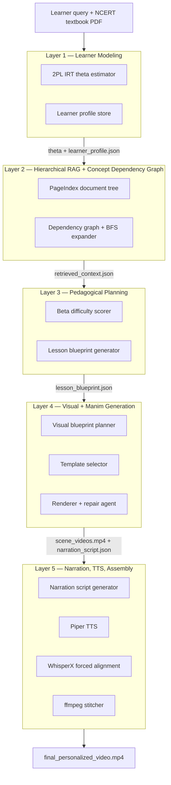

# AICARLS — AI-Driven Context-Aware Retrieval-Augmented Learning System

Turns NCERT textbook PDFs into personalized animated micro-lectures, adapted to a
learner's measured ability rather than a fixed script. A five-layer pipeline estimates what
a student knows (IRT), retrieves the right curriculum content *and its prerequisites*
(hierarchical RAG + concept dependency graph), decides how much scaffolding to add
(beta-theta gap planning), generates the animation as structured intent before code
(visual blueprint → Manim), and narrates/synchronizes the result (Piper TTS + WhisperX).

**Key results:** hierarchical retrieval with dependency expansion lifted prerequisite
coverage from 2.0/5 → 4.5/5 (NDCG@3 0.52 → 0.87) over flat dense retrieval · template-
constrained Manim generation hit a 91.4% first-attempt render success rate vs. 63.9% for
free-form LLM code generation · IRT theta estimates correlated 0.83 (Pearson r) with
ground-truth ability after 7 diagnostic questions.

Built as a B.E. AI & Data Science mini-project at M.S. Ramaiah Institute of Technology
(Jan–May 2026). Runs primarily on local hardware via Ollama, with a cloud LLM fallback
only when local inference is unavailable.

---

## Table of Contents

1. [Team & Ownership](#1-team--ownership)
2. [Problem & Approach](#2-problem--approach)
3. [High-Level Architecture](#3-high-level-architecture)
4. [My Contribution — Layer 2: Hierarchical RAG + Concept Dependency Graph](#4-my-contribution--layer-2-hierarchical-rag--concept-dependency-graph)
5. [Other Layers (System Context)](#5-other-layers-system-context)
6. [Technology Stack](#6-technology-stack)
7. [Results & Evaluation](#7-results--evaluation)
8. [Project Structure](#8-project-structure)
9. [Operating Environment & Setup](#9-operating-environment--setup)
10. [Known Limitations](#10-known-limitations)
11. [Future Work](#11-future-work)
12. [References](#12-references)

---

## 1. Team & Ownership

This was a 4-person team project. Responsibilities were split by architectural layer, not
duplicated — each person owns the design, implementation, and evaluation of their layer.

| Member | Layer Owned | Scope |
|---|---|---|
| **Abhishek L (1MS23AD004)** | **Layer 2 — Retrieval** | PageIndex adaptation for NCERT PDFs, concept dependency graph generation, three-condition retrieval architecture, dependency expander, retrieval evaluation/ablation infrastructure, JSON schema contracts across all layer boundaries |
| Joshua A David (1MS23AD029) | Layer 4 — Animation | Visual blueprint schema, Manim template library (15 templates), template selection classifier, render executor + repair agent, pass@1/pass@3 benchmarking |
| Mallanagouda Police Patil (1MS23AD034) | Layer 1 & 3 — Learner Modeling / Planning | 2PL IRT model, adaptive diagnostic question generation, beta difficulty scoring, lesson blueprint generation |
| Rishising Ranjitsing Rajput (1MS23AD047) | Layer 5 & Frontend | Narration script generation, Piper TTS integration, WhisperX alignment, ffmpeg assembly, React frontend |

Sections 4 and 8 of this README go into implementation depth on Layer 2 specifically,
since that's the component I designed, built, and can speak to in detail. Sections 3 and 5
describe the rest of the system at the level needed to understand how it fits together.

---

## 2. Problem & Approach

Most AI tutoring tools generate the same explanation regardless of what the learner
already knows, and most AI-to-animation pipelines generate code directly from intent —
which is unreliable (see §7.2 for the 4x failure-rate difference this causes).

AICARLS separates the problem into five independently testable layers instead of one
black-box LLM prompt:

1. **Measure** the learner's ability (IRT, not a quiz score)
2. **Retrieve** curriculum content *and its prerequisites* (not just top-k similar chunks)
3. **Plan** the lesson structure from the gap between content difficulty and learner ability
4. **Generate** the animation from a structured intermediate representation, not code directly
5. **Narrate and synchronize** audio to the generated visuals

Each layer has its own evaluable output (a JSON artifact) and its own metric, which is
what makes the ablation studies in §7 possible — you can't ablate a single prompt.

---

## 3. High-Level Architecture



**Why five layers instead of one prompt (design rationale):**
- Each layer is independently evaluable — this is what makes the retrieval ablation study
  and the Manim pass@1/pass@3 comparison possible.
- Layers upgrade independently as long as the JSON contract between them holds. Layer 4
  could be swapped for a different animation backend without touching Layer 1–3.
- The intermediate artifacts (lesson blueprint, visual blueprint, narration script) are
  forced to be explicit — they're both debugging surfaces and evidence of what the system
  actually computed at each stage, rather than opaque intermediate LLM reasoning.

---

## 4. My Contribution — Layer 2: Hierarchical RAG + Concept Dependency Graph

### 4.1 The core problem this layer solves

Document structure and knowledge structure are not the same thing. A PageIndex-style
tree tells you *"Speed belongs to the Motion chapter."* It does not tell you *"Speed requires
Distance and Time to understand."* Those are different graphs, and most RAG systems
conflate them by retrieving whatever's topically closest to the query, with no notion of
what the learner needs to already know first. This layer builds and combines both graphs.

### 4.2 PageIndex document tree

Extracts the NCERT PDF's table of contents and builds a tree where each node is a
document section (title, page range, auto-generated summary, keyword list, semantic
tags, content-type classification), serialized to `structure.json` and cached to disk after
first build. Chapter-to-section and section-to-subsection containment only — no
knowledge-dependency information yet.

**Non-standard PDF layouts:** ~15% of NCERT chapters embed section numbers in body
text instead of a clean TOC. Added a regex-based fallback scanner with a confidence
threshold to avoid false-positive section detection from body text that happens to contain
numbers.

### 4.3 Concept dependency graph construction

A single batched LLM call (local Ollama-served Gemma 3, 4-bit) over all node titles,
summaries, and keywords produces a JSON mapping of each concept to its prerequisite
concepts with a confidence score:

```json
{
  "simple_harmonic_motion": {
    "prerequisites": ["oscillation", "restoring_force", "periodic_motion"],
    "confidence": 0.89
  },
  "oscillation": {
    "prerequisites": ["motion", "time_period", "frequency"],
    "confidence": 0.93
  }
}
```

**Two failure modes had to be engineered around, not just prompted away:**

- *Over-deep chains.* Early runs produced prerequisite chains 6+ hops deep for complex
  physics concepts — technically defensible, pedagogically noisy. Tested depth limits
  against 30 sample queries and settled on a max traversal depth of **2 hops** as the best
  coverage/relevance tradeoff.
- *Plausible-but-wrong prerequisites at scale.* Feeding all 742 nodes in one prompt
  occasionally produced claims like "Light Reflection requires Electromagnetic Induction"
  (both involve waves, but it's not a real prerequisite). Fixed with two filters stacked: (1) a
  hallucination filter that discards any claimed prerequisite not present in the document
  tree, and (2) a semantic coherence check that embeds the claimed prerequisite and target
  node summaries and discards pairs with cosine similarity below 0.35.

### 4.4 Three-condition retrieval architecture

This is the part that matters most for interviews — it's a real ablation, not a claim.

| Condition | Method | Captures |
|---|---|---|
| **A — Flat dense retrieval (baseline)** | 512-token chunks, 50-token overlap, `all-MiniLM-L6-v2` embeddings, cosine similarity via **ChromaDB**, top-5 | Nothing structural — standard RAG baseline |
| **B — PageIndex node retrieval** | Traverse the document tree, score nodes by keyword overlap + summary similarity, return best node + parent + siblings | Document structure, not prerequisites |
| **C — PageIndex + dependency expansion (production default)** | Take B's target node, then BFS the concept graph up to depth 2, filter by relevance threshold, merge with B's structural context | Structure **and** prerequisite knowledge |

**On the vector-DB question specifically** (this comes up in interviews given the JD
language around embeddings): the system *does* use a vector store — ChromaDB with
`all-MiniLM-L6-v2` — but only as Condition A, the baseline being ablated against. The
production default (Condition C) is intentionally vectorless: tree traversal + keyword/
summary scoring + graph BFS. The reason is in the results table in §7.1 — Condition C
beat the vector baseline by +0.35 NDCG@3 and, more importantly, by +2.5 points (of 5) on
prerequisite coverage, which is the metric that actually matters for a learning system.
Flat similarity search has no way to know a concept needs a prerequisite it isn't textually
similar to.

### 4.5 Dependency expander (Algorithm)

```text
Input:  Query Q, Document Tree T, Concept Graph G, depth_limit = 2
Output: Retrieved context set C

1. Score all nodes in T against Q (keyword overlap + summary similarity)
2. top_node ← highest-scoring node
3. Retrieve parent(top_node), siblings(top_node) from T
4. prerequisites ← {}, Queue ← {top_node}, depth ← 0
5. While Queue not empty and depth ≤ depth_limit:
     current ← dequeue(Queue)
     for each prereq in G[current].prerequisites:
         if prereq not in prerequisites:
             prerequisites.add(prereq); enqueue(Queue, prereq)
     depth += 1
6. Score prerequisites against Q; filter by relevance threshold
7. C ← {top_node, parent, siblings} ∪ prerequisites
8. Return C with page content from extracted_pages.json
```

Circular dependencies are detected and skipped during BFS. The relevance-threshold
filter in step 6 exists specifically because unfiltered BFS expansion pulls in tangentially
related nodes that share a graph edge but aren't useful for *this* query.

### 4.6 What else I owned

- JSON schema contracts (Pydantic) for every inter-layer boundary — the thing that let four
  people build five layers in parallel without a big-bang integration disaster
- The full evaluation infrastructure for the retrieval ablation (150 hand-constructed
  queries, human-annotated ground truth, NDCG@3 computation, inter-annotator
  agreement measurement)

---

## 5. Other Layers (System Context)

### Layer 1 — Learner Modeling (2PL IRT)
`P(correct | θ, aᵢ, bᵢ) = 1 / (1 + exp(−aᵢ(θ − bᵢ)))`. Theta (ability) estimated via MAP
inference from an N(0,1) prior, updated after each diagnostic response; items selected
adaptively by maximum Fisher information. Minimum 5 responses before theta is trusted
downstream; escalates to 7 if the confidence interval hasn't tightened by then.

### Layer 3 — Pedagogical Planning
`beta = 0.4·concept_density + 0.35·dependency_depth + 0.25·summary_readability`.
`delta = beta − theta` drives a lookup table deciding scaffolding level (minimal → intensive),
scene count (3–4 → 9–12), analogy scenes, and whether prerequisite review is required —
operationalizing Vygotsky's Zone of Proximal Development as a deterministic decision
table rather than another LLM judgment call.

### Layer 4 — Visual Blueprint + Manim Generation
The key architectural bet: don't ask an LLM to go straight from pedagogical intent to
Manim code. Generate a structured JSON visual blueprint first (visual goal, representation
type, objects, duration, narration word budget), classify it against a library of 15 validated
Manim templates, slot-fill, render, and repair on failure (max 3 attempts, then fall back to
a plain-text scene). This intermediate representation is why template-constrained
generation hits 91.4% pass@1 vs. 63.9% for free-form generation (§7.2).

### Layer 5 — Narration, TTS, Assembly
Narration length is constrained to fit the scene's duration budget
(`max_words = duration_sec × (140/60) × pacing_factor(theta)`), synthesized with local
Piper TTS (Indian English voice), aligned word-by-word with WhisperX forced alignment,
and stitched with ffmpeg. A post-generation duration check regenerates narration at 15%
fewer words if the TTS output overruns the scene by more than 15%.

---

## 6. Technology Stack

| Technology | Role |
|---|---|
| Python 3.11 | Primary backend language |
| PageIndex (fork) | Hierarchical document indexing, base for the retrieval layer |
| Ollama + Gemma 3 (4-bit) | Local LLM inference — TOC parsing, concept graph, blueprints |
| Qwen2.5 3B | Lightweight title cleanup / OCR polish |
| ChromaDB + `all-MiniLM-L6-v2` | Vector store — Condition A ablation baseline only |
| Manim Community Edition | Renders Python scene classes to MP4 |
| Piper TTS | Local, offline Indian-English text-to-speech |
| WhisperX | Forced audio-to-text alignment for narration sync |
| FFmpeg | Multimedia assembly, transitions, final MP4 export |
| FastAPI | REST API exposing the pipeline with progress streaming |
| React 18 + TypeScript | Frontend — onboarding, dashboard, video player, concept graph overlay |
| D3.js | Force-directed concept graph visualization |
| Pydantic | Schema validation for every inter-layer JSON contract |
| PyMuPDF (fitz) | PDF text extraction |
| scipy.optimize | MAP estimation for IRT theta |
| Gemini API | Fallback only, when local inference is unavailable |

---

## 7. Results & Evaluation

### 7.1 Retrieval ablation (150 queries, NCERT Physics Class 9, 2 human annotators, κ = 0.81)

| Condition | NDCG@3 | Topical Accuracy | Terminology Alignment | Prerequisite Coverage |
|---|---|---|---|---|
| A: Flat dense (ChromaDB baseline) | 0.52 | 3.7 / 5 | 2.8 / 5 | 2.0 / 5 |
| B: PageIndex node retrieval | 0.75 | 4.3 / 5 | 4.1 / 5 | 3.3 / 5 |
| **C: PageIndex + dependency expansion** | **0.87** | **4.5 / 5** | **4.4 / 5** | **4.5 / 5** |

Prerequisite coverage is where the architecture earns its complexity — it more than
doubles from baseline to Condition C, while topical accuracy only moves modestly from B
to C (expected: both B and C retrieve the same directly-relevant node; C just adds
prerequisites on top).

### 7.2 Manim generation: template-constrained vs. free-form (150 blueprint entries, 10 runs each)

| Approach | pass@1 | pass@3 |
|---|---|---|
| Free-form LLM code generation | 63.9% | 79.7% |
| **Template-constrained generation** | **91.4%** | **97.5%** |

First-attempt failure rate drops from 36.1% → 8.6% (≈4x reduction). Template selection
classifier accuracy: 95.0%. Weakest category: oscillation/motion scenes at 89.8% pass@1 —
mostly extreme amplitude/period combinations exceeding Manim's frame-rate budget,
mitigated with a pre-generation parameter-normalization step.

### 7.3 IRT learner model (25 held-out questions × 15 simulated learner profiles)

- Pearson correlation to ground-truth ability: **0.83** after 7 questions (design target was
  0.78), **0.89** after 10 questions
- Mean absolute theta error: 0.14 scale units at the 7-question mark

### 7.4 Pipeline latency (average per component-level request, 100 runs)

| Layer | Avg. Latency | % of Total |
|---|---|---|
| Layer 1 — IRT | 0.18s | 1.4% |
| Layer 2 — Retrieval | 1.21s | 9.5% |
| Layer 3 — Planning | 1.05s | 8.2% |
| Layer 4 — Manim generation | 7.83s | 61.3% |
| Layer 5 — TTS + Assembly | 3.27s | 19.6% |
| **Total** | **12.76s** | 100% |

Manim generation dominates cost, as expected for anything doing code-gen + render +
repair. Full end-to-end generation for a 4-scene lesson (multiple Manim calls,
sequentially) runs ~7 minutes — acceptable given results are cached per topic/theta-range
and the one-time textbook indexing cost amortizes across all future queries.

---

## 8. Project Structure

```
aicarls/
├── modules/
│   ├── rag/
│   │   ├── hierarchical_retriever.py     # Conditions A/B/C retrieval
│   │   ├── dependency_graph_builder.py   # concept_graph.json generation + filtering
│   │   └── dependency_expander.py        # BFS prerequisite expansion (Algorithm 1)
│   ├── profiling/
│   │   └── irt_engine.py                 # 2PL IRT, MAP theta estimation
│   ├── planning/
│   │   └── pedagogical_planner.py        # beta scoring, lesson_blueprint.json
│   ├── manim/
│   │   ├── visual_planner.py
│   │   ├── template_selector.py
│   │   ├── render_executor.py
│   │   └── repair_agent.py
│   ├── tts/
│   │   ├── narration_writer.py
│   │   └── piper_tts.py
│   ├── sync/
│   │   └── whisper_align.py
│   └── video/
│       └── stitcher.py
├── frontend/                             # React 18 + TypeScript
└── data/
    ├── structure.json                    # PageIndex document tree (per textbook)
    ├── concept_graph.json                # filtered prerequisite graph (per textbook)
    └── learner_profile.json              # per-learner theta + response history
```

> File paths above are drawn directly from the module references in the project report.
> Confirm against the actual repo layout before publishing if anything has moved since.

---

## Run with Docker

This repository now includes a minimal Docker setup for development and local testing. The default setup is CPU-compatible and keeps Python dependencies inside the container image; the application source is mounted into the container so you can edit code without rebuilding the image for every change.

### 1. Prepare environment variables

Create a local `.env` file from the example file and fill in any required keys:

- Windows PowerShell:
  ```powershell
  Copy-Item .env.example .env
  ```
- macOS / Linux:
  ```bash
  cp .env.example .env
  ```

At minimum, set one of the following before running the pipeline:

- `GEMINI_API_KEY`
- `NVIDIA_API_KEY`

The existing app also supports these optional variables:

- `OLLAMA_HOST` and `OLLAMA_MODEL` for local Ollama-backed inference
- `PIPER_MODEL`, `WHISPERX_MODEL`, `WHISPERX_DEVICE`, `USE_WHISPERX`
- `LOG_LEVEL`, `MANIM_*`, and related tuning values

> No real secrets should be committed. Keep `.env` untracked and use `.env.example` as the template.

### 2. Build and start the stack

- Windows PowerShell:
  ```powershell
  docker compose build
  docker compose up
  ```
- macOS / Linux:
  ```bash
  docker compose build
  docker compose up
  ```

The default stack starts:

- Backend API: `http://localhost:5000`
- Frontend UI: `http://localhost:3000`

The health endpoint is available at:

- `http://localhost:5000/api/health`

### 3. Optional Ollama service

The repository’s PageIndex/local inference logic can use Ollama. In this Docker setup, Ollama is intentionally optional and CPU-friendly by default:

- If you already have Ollama running on the host, set `OLLAMA_HOST=http://host.docker.internal:11434` in `.env`.
- If you want to run Ollama inside Docker instead, uncomment the `ollama` service block in `docker-compose.yml` and keep the same `OLLAMA_HOST` setting.
- No GPU configuration is enabled by default.

### 4. Useful Docker commands

- View backend logs:
  ```bash
  docker compose logs -f backend
  ```
- View frontend logs:
  ```bash
  docker compose logs -f frontend
  ```
- Stop the stack:
  ```bash
  docker compose stop
  ```
- Restart the stack:
  ```bash
  docker compose restart
  ```
- Open a shell inside the backend container:
  ```bash
  docker compose exec backend bash
  ```
- Rebuild after dependency or Dockerfile changes:
  ```bash
  docker compose build --no-cache
  docker compose up
  ```
- Remove containers and project volumes:
  ```bash
  docker compose down -v
  ```

> Use `docker compose down -v` only when you want to discard the named volumes created for the project. It will remove persistent data created by the stack.

---

## 9. Operating Environment & Setup

**Requirements:**
- Python 3.11+
- Node.js (for the React 18 frontend)
- 16 GB RAM minimum, 50 GB storage (model files + project data)
- [Ollama](https://ollama.com) installed, with Gemma 3 (4-bit) pulled locally
- Manim Community Edition + a LaTeX installation (for equation rendering)

**Backend**
```bash
python -m venv venv
source venv/bin/activate
pip install -r requirements.txt
# pull the local model
ollama pull gemma3:4b
```

**Frontend**
```bash
cd frontend
npm install
npm run dev
```

> Exact entry-point scripts (e.g. `uvicorn app.main:app`) aren't specified in the source
> report — swap in whatever your actual FastAPI app module is before publishing this.

---

## 10. Known Limitations

Documented honestly, since these are the first things a strong interviewer will probe:

| Limitation | Detail |
|---|---|
| **Subject/grade scope** | Calibrated only for NCERT Physics & Mathematics, Class 9–10. New subjects/grades need re-indexing and IRT item-bank re-calibration with fresh pilot data. |
| **Manim template coverage** | 15 templates cover physics/math visual patterns; no chemistry, biology, or social science templates yet. |
| **Static learner model** | IRT gives a single ability snapshot, not per-concept knowledge tracing across sessions — personalization is difficulty-level adaptation, not fine-grained prerequisite-gap targeting. |
| **End-to-end latency** | ~7 minutes for a 4-scene video. Fine for cached, non-interactive generation; too slow for a live back-and-forth tutoring UX. |
| **Cross-encoder reranker** | Planned in the enhancement scope, not implemented — retrieval scoring is keyword + summary similarity, not a trained reranker. |
| **Concurrency** | Scope explicitly excludes support for more than 10 simultaneous generation sessions. |
| **Non-NCERT textbooks** | Supported only with manual re-indexing; no automatic format adaptation. |

---

## 11. Future Work

- Replace the static IRT snapshot with dynamic Bayesian Knowledge Tracing, updating
  per-concept state after each video and embedded comprehension checkpoint
- Fine-tuned prerequisite-relation classifier (e.g. trained against an educational ontology
  like Khan Academy's content graph) instead of a single LLM extraction pass
- Cross-encoder reranker for retrieval scoring
- Template library expansion to chemistry, biology, social science
- Multi-language narration
- Parallelize narration generation and visual blueprint generation (currently sequential
  despite having no data dependency on each other) — estimated 25–35% latency reduction

---

## 12. References

Full literature survey and citation list are in the project report (Chapter 3, Chapter 11
References). Core external components this system builds on: PageIndex (hierarchical
document indexing), Manim Community Edition (Sanderson, 2023), Piper TTS, WhisperX
(Radford et al., 2023 — forced alignment via Whisper), Sentence-BERT (Reimers &
Gurevych, 2019 — embeddings for the Condition A baseline).

---

**Academic project — B.E. Artificial Intelligence & Data Science, M.S. Ramaiah Institute
of Technology, Feb–May 2026.** See repository license file.
