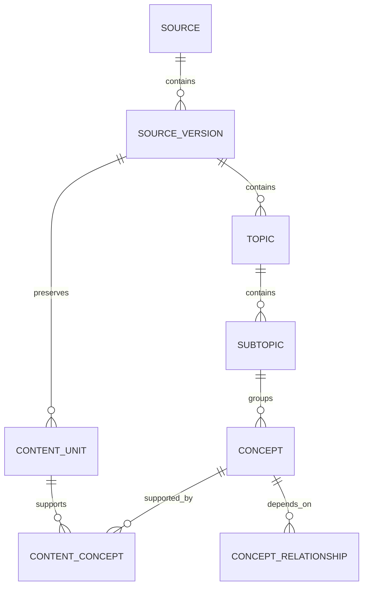
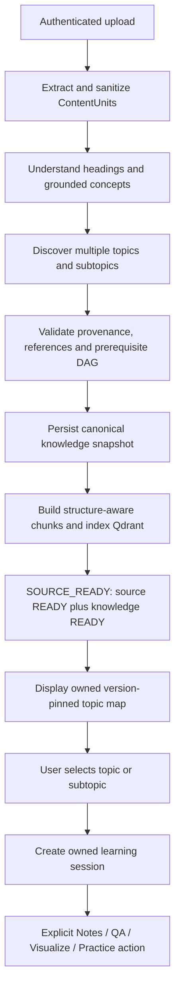

# Phase 6A — Knowledge model and API architecture

**Status:** design for implementation; no application changes or migrations performed.
**Audit date:** 7 October 2026 (Asia/Calcutta).
**Workspace:** `C:\Users\ANVESH\Desktop\AI-VIDEO-GENERATOR`.
**Branch:** `stabilization-python312` (verified); initial elevated `git status --short` was clean.
**Remote project:** `hqszkkvuxwdedhegqbec`; schema, constraints, policies, grants, functions and migration history inspected through the installed Supabase MCP using read-only queries.

## 1. Existing architecture findings

Keep the existing FastAPI application and domain engines. Supabase is canonical domain storage; Qdrant remains the derived semantic index. Ollama reasoning/embeddings and OpenRouter vision remain provider integrations. Phase 5A/5B behavior must survive every subsequent change.

| Existing asset | Evidence in repository | Reuse and current limitation |
|---|---|---|
| Source identity | `app/services/schemas.py: SourceRecord` | Keep `source_id`, asset/upload IDs, owner UUID mapping, hash, integer `version`, display `source_version`, parser/sanitizer versions, parent source and status. Legacy model defaults are labels, never authorization. `source_type` belongs to the source; `modality` belongs to content. |
| Durable versions | `app/services/repositories/source_repository.py: SourceVersion` | Keep snapshot JSON for normalized/sanitized/quarantined content, rich chunks and blueprint. Binary originals remain local files referenced by `file_location`; this does not make domain JSON canonical on disk. |
| Canonical evidence | `app/services/schemas.py: ContentUnit` | Keep text, sequence, heading path, chapter/section, page/slide/time references, offsets, parent and extraction confidence. Database adds required owner/version/provenance fields not currently represented in this DTO; introduce an explicit scoped envelope instead of losing them during decoding. |
| Concepts and graph | `ConceptNode`, `KnowledgeGraph`, `app/services/concept_id.py` | Keep concept canonicalization, prerequisite/related IDs and `source_content_ids`. Graph is currently a local JSON artifact; deployed concept tables are available but source ingestion does not populate them. |
| Structure understanding | `app/services/structurer.py` | Reuse bounded batching, grounded content references, collision detection, missing-reference and prerequisite cycle checks. `TopicBlueprint` describes one document summary; it is not a persisted multi-topic hierarchy. Never manufacture sequential prerequisites during fallback. |
| Structure-aware chunks | `app/services/chunker.py: create_rich_chunks` | Reuse deterministic chunk IDs and per-unit text splitting with concept/content associations. Current implementation splits each unit; its docstring's section-grouping claim exceeds its behavior. Preserve true spans before introducing grouping across units. |
| Source transaction | `source_repository.py`, `app/services/ingestion/source_ingestion.py` | Canonical source/version/content commit is atomic through RPC. Indexing follows commit and supports durable retry without re-extraction. Local graph write can still fail after canonical commit. |
| Semantic retrieval | `app/db/vector_store.py` | Reuse genuine embedding provenance checks, Layer A filters and Qdrant. Existing entry points: `search_source_chunks`, `retrieve_exact_chunks`, `retrieve_layer_b_scene`. Owner filters sometimes include `student_default`; version is optional; exceptions can become empty results. These are blockers for the proposed shared contract. |
| Grounded QA | `app/services/qa/grounded_answer.py`, `answer_validator.py`, `Citation` | Reuse evidence fences, refusal, citations and answer validation. Current verification works against retrieved payloads; add canonical DB hydration. Traces currently use local JSON. |
| Learning logic | `app/services/mastery/*` | Reuse prerequisite provider, mastery state machine, attempt validation, personalization, remediation and deterministic roadmap logic. Application defaults for mastery/attempt/question registry/misconception/remediation are in-memory. Source/graph access still reads local registry. |
| Persistence adapters | `app/services/repositories/factory.py`, `supabase_repository.py` | Source factory requires verified user context. Assessment and learning-profile classes named Supabase still delegate to files; naming is not evidence of remote persistence. |
| Router wiring | `app/main.py`, `app/api/*` | Existing monolith uses independent routers. Auth and source boundaries verify identity; several older QA/assessment/video/learning handlers use request identities or local state. No global JWT middleware makes these handlers secure automatically. |

### Verified deployed baseline

Remote migration history is authoritative; local filenames have different timestamps:

| Deployed version/name | Local corresponding artifact |
|---|---|
| `20261005190025 corrected_foundation_schema` | `migrations/20261005185233_corrected_foundation_schema.sql` |
| `20261006142045 source_current_version_index` | `migrations/20261006141158_source_current_version_index.sql` |
| `20261006142056 source_ingestion_transaction` | `migrations/20261006141202_source_ingestion_transaction.sql` |

`migrations/001_supabase_initial_schema.sql` is not listed as deployed. Do not replay it or infer deployment from filenames. This audit verified live objects, not byte-identical migration contents.

All 15 public tables have RLS enabled: `profiles`, `sources`, `source_versions`, `content_units`, `concepts`, `concept_relationships`, `assessment_sessions`, `assessment_questions`, `assessment_attempts`, `learning_profiles`, `concept_mastery`, `misconceptions`, `remediation_jobs`, `video_target_matrices`, `generated_videos`. No deployed topics/subtopics or content-concept join table exists.

Domain tables have authenticated owner SELECT policies using `(select auth.uid()) = user_id`. Profiles additionally allow owner INSERT and UPDATE using `id`. Inspected concept/content/version grants give `authenticated` SELECT only; no anonymous grants were returned for those tables. Thus new knowledge writes cannot work through ordinary PostgREST inserts without a deliberately designed write path.

`public.visualai_commit_source_ingestion` and `public.visualai_source_index_status` are invoker wrappers. Their `visualai_internal` implementations are definers with explicit `auth.uid()` checks and empty search paths in the local migration. Reuse this bounded-write pattern only where necessary; do not introduce broadly privileged agent access. Existing composite foreign keys already enforce owner/source/version consistency, including both concept relationship endpoints.

## 2. Proposed API division

One application; one verified request context; separate domain services and repositories. Preserve existing paths and response contracts wherever possible. New routes below are proposals, not implemented endpoints. Browser payloads never supply authoritative `user_id` or `student_id`.

| Domain / service | Existing routes to retain | Proposed responsibility / minimal addition |
|---|---|---|
| Auth / existing runtime | `/api/auth/signup`, `/login`, `/refresh`, `/me`, `/logout` under that prefix | Identity, sessions, confirmation and profile provisioning. Reuse verified UUID dependency in every protected domain. |
| Source / existing source service | `GET /sources`, `GET /sources/{id}`, `/versions/{version}`, `/content-units`; `POST /sources/{id}/retry-index`; `POST /upload`; `/pipeline/jobs/{id}` with events/retry/cancel | Upload/extract and durable source aggregate; never launch assessment for Supabase ingestion. Retain `/pipeline/upload-and-assess` as a compatibility entry point whose Supabase branch already queues source-only work. |
| Knowledge / `KnowledgeService` | Reuse structurer, concept tables and graph DTO | `GET /sources/{id}/versions/{version}/knowledge` returns topic map plus readiness; `GET /knowledge/concepts/{concept_id}` requires source/version query scope. Discovery runs inside ingestion; no arbitrary browser graph writes. |
| Retrieval / `RetrievalService` | Existing vector functions become internal adapters | Shared typed service is primary interface; optional `POST /retrieval/evidence` accepts only bounded filters and query. No duplicate QA generation endpoint. |
| Learning / existing adaptive service plus `LearningSessionService` | `/api/learning/{id}/state`, `/roadmap`, `/next-action`, `/assessment/submit`, `/reassessment/generate`, `/remediation`, `/remediation/{job_id}` | Add `POST /api/learning/sessions`, `GET /api/learning/sessions/{id}` when durable sessions are implemented. Pin owner/source/version and selected topic/subtopic. Register literal `/sessions` routes before existing `/{source_id}` routes. |
| Notes / `NotesService` | No dedicated notes route found | Future `POST /notes/generate`, `GET /notes/{id}`; explanation/diagram modes share evidence and artifact validation. Implement after centralized retrieval. |
| QA / existing grounded-answer service | `POST /qa/answer`, `GET /qa/traces/{user_id}/{source_id}` | Consume central evidence. Old path identity must equal verified UUID or be rejected; it never selects another user's trace store. |
| Assessment / existing engine | `/assessment/start`, `/handoff`, `/submit`, `/profile/{student_id}/{source_id}`, `/status/{session_id}`, `/session/{session_id}`, `/video-target/{student_id}/{source_id}` | Selected-scope question generation, grading and existing session persistence. Authenticated ownership must protect lookup and mutation; legacy labels remain compatibility metadata only. |
| Video / existing engine | `/video/generate`, `/status/{job_id}`, `/{job_id}`, stream/metadata/captions/subtitles routes | Reuse generation and QA pipeline; verify job owner and evidence scope before generation and artifact reads. |
| Mastery / existing state machine | Existing learning state/submission paths | Internal authoritative progression service. Do not introduce a public endpoint allowing arbitrary mastery assignment. |
| Roadmap / existing personalization service | Existing `/api/learning/{id}/roadmap` and `/next-action` | Retain deterministic prerequisite/mastery planning. No second roadmap router is required. |
| Agent orchestration / bounded coordinator | Existing pipeline/job lifecycle infrastructure | Internal typed commands first. A future task status route should reuse existing owned job status instead of duplicating a job system. Agents receive approved capabilities, not repositories or keys. |

Auth dependencies resolve an `AuthenticatedUser`; request DTOs reject ambiguous cross-scope selectors. Repository selection happens once per request. Compatibility wrappers call the same service as new routes. Expected errors use safe codes: 401 invalid identity, 404 unavailable/foreign scope, 409 stale version or readiness conflict, 422 invalid selections, 503 unavailable provider. Empty evidence is a domain outcome, distinct from infrastructure failure.

## 3. Knowledge data model

Use an immutable source-version snapshot scope `S = (user_id UUID, source_id text, source_version positive integer)`. The relational integer references `source_versions.version`; existing display strings such as `v2` remain explicit boundary mappings, never interchangeable keys.

This hierarchy is source-version scoped, not a global taxonomy. A concept belongs to one primary subtopic in this first slice; a ContentUnit supports any number of concepts. If cross-subtopic membership is later required, add a join then; do not add speculative taxonomy tables now.

### Three core new tables

| Table | Proposed columns and constraints |
|---|---|
| `topics` | `S`, `topic_id text`, `title text`, `description text nullable`, `sequence_index integer >= 0`, `provenance jsonb object`, `created_at timestamptz`; PK `(S, topic_id)`, FK `S -> source_versions(user_id,source_id,version)`, unique `(S, sequence_index)`, nonempty ID/title. Multiple topics per version. |
| `subtopics` | `S`, `subtopic_id text`, `topic_id text`, `title`, optional description, sequence, provenance, created_at; PK `(S, subtopic_id)`, composite FK `(S,topic_id) -> topics`, unique `(S,topic_id,sequence_index)`. Every subtopic has exactly one topic. |
| `content_concepts` | `S`, `content_id text`, `concept_id text`, `support_kind` (`definition`, `explanation`, `example`, `prerequisite_evidence`), optional `char_start/char_end`, extraction confidence in `[0,1]`, provenance object; PK `(S,content_id,concept_id,support_kind)`; composite FKs to existing content/concept owner-scoped unique keys. Offsets must refer to canonical sanitized unit text, satisfy `0 <= start < end <= length(text)` when provided, and be checked by transaction validation. |

Extend existing `concepts` additively with nullable `subtopic_id`, `sequence_index` and provenance. Backfilled complete snapshots require a subtopic and nonnegative order; enforce these as a complete-snapshot transaction invariant until old rows are migrated. Composite FK `(S,subtopic_id) -> subtopics`; preserve existing PK and `concept_id`. A unique partial order index `(S,subtopic_id,sequence_index)` for mapped rows prevents duplicate ordering without invalidating old rows.

Reuse `concept_relationships`, with `relationship_type='prerequisite'` meaning **concept_id depends on related_concept_id**; `related` does not imply a prerequisite. Keep existing no-self-edge check and both composite FKs. Add provenance and confidence if needed to record extraction/review justification. Directed prerequisite edges must form a DAG; validate the entire snapshot under a transaction lock, not just each inserted edge. Unknown or unsupported prerequisites remain unresolved suggestions and are not persisted as authoritative dependencies.

Reuse `concepts.source_content_ids` as a compatibility projection of the union of `content_concepts` IDs, updated in the same transaction. The join becomes authoritative; never maintain two independent association stores. Topic/subtopic support is derived through concept membership and content joins, avoiding duplicate topic-content tables. Require nonempty valid evidence for accepted concepts; a topic without enough evidence is explicitly incomplete.

### Identity, structure and provenance

- Preserve existing source/content/concept IDs; new topic/subtopic IDs use validated structural keys assigned deterministically within a version. Titles are not IDs. Detect collisions rather than silently merging labels.
- Changed uploads currently generate a new `source_id` from owner/filename/hash and link `parent_source_id`; they also increment version from the prior filename. Do not redesign this lineage or presume all versions share a source ID. Exact scope includes both fields. No automatic concept/mastery carryover across parents.
- Content order and page/section/heading/span/time metadata remain in `content_units`; associations point to those units. Citations derive from canonical metadata, not LLM-provided page numbers.
- Provenance has a typed, schema-versioned structure: source hash, parser/sanitizer versions, extraction method, supporting content IDs/spans, model/provider identifier, validation result and decision/operation ID. No secrets or hidden prompts. Generated titles/definitions are derived annotations, not original source text.
- Approved graph content must be readable from Supabase with no local graph file. `KnowledgeGraph` and `TopicBlueprint` remain DTO projections for existing consumers; blueprint is a summary, not the hierarchy authority.
- Add a compact `source_versions.knowledge_state` (`PENDING`, `READY`, `FAILED`, `LEGACY_UNMAPPED`), `knowledge_schema_version`, and structured credential-free knowledge diagnostics/provenance. Keep `sources.status` values intact. New ingestion is complete only when its knowledge state and vector indexing are both ready.

## 4. Supabase migration plan

This is a migration specification only. Do not alter or replay deployed files. In the implementation phase, generate a fresh migration with the installed CLI after checking its help/version, then review and deploy separately.

1. Preflight live catalog/migration history again. Compare constraints and grants with this baseline; take an approved recovery snapshot before deployment. Do not infer empty or populated knowledge tables from schema existence; no application row counts were needed for this design.
2. Add the three core tables, nullable concept membership metadata and version knowledge state. Existing snapshots default to `LEGACY_UNMAPPED`; new writers explicitly choose `PENDING`. No ungrounded default topics or backfill ownership.
3. Add composite FKs and checks, owner SELECT policies and explicit least-privilege grants in the same migration. Index topic order `(S,sequence_index)`, subtopic order `(S,topic_id,sequence_index)`, concept membership/order `(S,subtopic_id,sequence_index)`, and reverse content association `(S,concept_id,content_id)`; join PK supports content-first lookup. Existing relationship endpoint indexes already exist; do not duplicate them. Review query plans on representative fixtures before adding JSON/GIN indexes.
4. Add a bounded knowledge-snapshot commit RPC with fixed signature and an invoker public wrapper. Domain tables remain client SELECT-only. Internal definer, if required by restricted writes, derives caller from `auth.uid()`, rejects null/mismatched owners, checks every referenced record, uses empty search path and fully qualified objects, revokes PUBLIC/anon execution, and exposes only the authenticated wrapper capability. Internal executability is never treated as a substitute for identity checks.
5. Commit topics, subtopics, concepts, associations, relationships and `knowledge_state=READY` atomically. Lock the owner/version snapshot; use operation ID and canonical payload hash for idempotence. Same operation/hash returns the existing result; conflicting payload returns 409. Completed snapshots are immutable. Structural revision requires a separately designed revision protocol; it cannot silently change a session's evidence.
6. Add a new ingestion orchestration RPC/version if full source + knowledge publication must be one transaction. Preserve the old three-argument source RPC for compatibility. A staged first implementation can commit source content, then the knowledge transaction; an interrupted job stays PENDING and resumes from durable content. Do not index/publish new knowledge-aware READY before this transaction succeeds.
7. Backfill separately under controlled owner identity and review: canonical content snapshots are inputs; existing local graphs are proposals requiring content/owner/hash/reference validation. Re-run understanding if graph provenance cannot be established. Dry-run reports precede writes. Never map `student_default` to an arbitrary UUID or copy Qdrant text into canonical evidence.
8. Retry vector indexing from committed chunks; existing sources retain their Phase 5B readiness and can show `LEGACY_UNMAPPED` topic-map state until backfilled. Roll out new ingestion only after writer/read models and RLS tests are ready. Reverting application feature use leaves additive tables intact; destructive rollback is a separate approved operation.

**RLS design:** all new exposed tables enable RLS with authenticated SELECT `(select auth.uid()) = user_id`, no null ownership, no anonymous reads, and no direct client mutation grants. Composite FKs prevent links across owners and versions. RPC validation is mandatory because a definer may bypass RLS. If future direct UPDATE is introduced, both USING and WITH CHECK must bind the owner; it is not part of this slice. Test anonymous, owner, foreign user, forged parent references and direct RPC calls. Agents never receive these write capabilities. Views, if introduced, use invoker semantics.

**Deferred consumer migrations:** a learning-session table is required before durable topic selection sessions are implemented, with verified owner, exact version scope, selected topic/subtopic, resolved concept IDs, expiry/state and timestamps; it is distinct from `assessment_sessions`. Notes/diagrams and durable generation/audit records are introduced only with those consumers. No new table duplicates mastery, assessment, remediation or video tables already deployed. Existing job infrastructure must gain durable canonical state before restart-safe agent orchestration is promised.

## 5. Central retrieval contract

Introduce one typed internal `RetrievalService.retrieve(context, request) -> EvidenceBundle`, with strict models (`extra='forbid'`, no `Any` fields), independent Qdrant and canonical repository adapters. Notes, QA, assessment, video, roadmap explanations, remediation and agents all consume it. Deterministic roadmap planning itself needs graph/mastery, not an unnecessary vector query.

| Contract | Fields / invariants |
|---|---|
| `VerifiedContext` | Server-resolved `user_id UUID`, operation/request ID and privately held caller token/capability. Never serialized to models or agent logs. Public request does not choose owner. |
| `RetrievalRequest` | `source_id`, `source_version int > 0` (required), optional `topic_id`, `subtopic_id`, `concept_ids: list[str]`, `query: str`, `purpose: Literal[notes,qa,assessment,video,roadmap,remediation,agent]`, optional owned learning-session ID, `limits` and retrieval mode. |
| `EvidenceLimits` | Positive bounded max items, total text tokens and per-item tokens. Proposed initial defaults: 5 items / 3000 total tokens / 800 per item; caps 20 / 8000 / 2000, evaluated against model context minus prompt/output budget. Named configuration values and tokenizer/version are required; these are design defaults, not measured product limits. |
| `EvidenceItem` | `content_id`, `source_id`, integer source version, `chunk_id`/span reference, canonical text, sequence, concept IDs, topic/subtopic IDs derived from DB joins, page range/section/heading path, optional slide/time/span, structured citation, typed provenance and nullable retrieval score. |
| `EvidenceBundle` | Evidence/trace ID, resolved scope, items, canonical manifest digest, applied limits, embedding provenance, rejected-candidate reason counts and `outcome: ready | insufficient_evidence | index_unavailable`. Infrastructure exceptions remain explicit and safely classified. |

Selectors are intersection constraints, not permission hints: validate topic/subtopic ancestry; explicit concepts must exist within selected scope; topic-only expands to its subtopics/concepts. Empty selection returns insufficient evidence, never unrestricted search. A selected subtopic may resolve its parent automatically, but contradicting topic input is rejected. Prerequisite expansion is explicit and bounded, within the same owner/version; never silently include another source.

### Verification pipeline

1. Verify JWT using the Phase 5A runtime; confirm source/version/session ownership through caller-token PostgREST/RLS. Resolve all selectors against canonical knowledge. Foreign or missing scopes return the same 404 boundary.
2. Resolve allowed content IDs from canonical joins. Query Qdrant using exact owner equality, exact source and mapped version (`int 2 -> v2` for current payloads), Layer A, retrieval allowed, clean/sanitized injection state, resolved concepts and compatible real embedding provider/model/dimension. No `student_default` OR, absent owner, optional version broadening or hash-vector production fallback.
3. Treat vector payloads as candidate pointers and scores. Hydrate ContentUnits and durable rich-chunk manifest from Supabase under the caller identity; compare source/version/hash/content/span and concept association. Drop stale/forged/orphan candidates. Chunk text must correspond to canonical text/spans; token-normalized comparisons are explicit and do not permit fabricated additions.
4. Build excerpts and citations from canonical data, deduplicate overlaps, preserve order and apply total token budget. Score is semantic rank, never factual confidence. Exact evidence mode can read known canonical content references with nullable score; it is explicit, logged, and still scoped, not a silent outage fallback.
5. Reuse grounding validators, strengthening them to check quotes against this canonical bundle. Generation consumes a verified manifest and rejects missing citations, unsupported claims or insufficient evidence. Agents cannot mark evidence valid themselves.

Canonical **Layer A** content is extracted/sanitized source evidence in Supabase. Qdrant vectors and metadata are disposable representations regenerated from that content. **Layer B** video scenes/notes/diagrams are generated artifacts with approved status and backlinks to Layer A; they never become canonical source evidence. Existing video timestamp context may guide retrieval, but must validate owned artifact/version and hydrate its Layer A references. Artifacts cannot cite each other recursively as source proof.

Caching keys include owner/source/version/selection/purpose/manifest digest and embedding provenance. Do not return cached foreign scope. Trace/audit records retain IDs, decisions and validation outcome with bounded retention; secrets and tokens are excluded. Durable audit persistence is a consumer implementation prerequisite, not an existing guarantee.

## 6. Topic selection flow

Keep current source status `READY`; `SOURCE_READY` is a derived UI/event condition, not an unplanned new database enum. Show topic counts, ordered subtopics/concepts and cited source sections. Incomplete maps display pending/failed/unmapped state rather than invented titles. Use existing job progress/events; future progress metadata can represent understanding/knowledge publication without breaking old consumers.

User selection is saved with resolved concept IDs and version. Generation checks that immutable snapshot on each call. New upload does not retarget an existing session; the user explicitly opens a new version/session. Failure after canonical commit is recoverable from content, then knowledge, then vector stages. Failed indexing must not trigger assessment or re-extract already committed content.

`POST /pipeline/upload-and-assess` already uses source-only work in Supabase mode; maintain that behavior. Practice starts assessment only after an explicit user action. Existing notes/QA/video/assessment services are adapted behind their routers rather than replaced.

## 7. Agent interfaces and boundaries

Agents are future internal adapters, not implemented in this phase. Shared envelope: verified scope capability, task/operation ID, immutable input manifest, named policy/model version and deadline. Output: typed proposal/report, evidence references, reason codes, validation results, attempts and terminal state. No tokens, arbitrary SQL, repositories, admin keys, arbitrary filesystem access or unrestricted tools are supplied to a model.

| Agent | Explicit input | Output | Required validation / bounded failure |
|---|---|---|---|
| Content Quality | Sanitized ContentUnits, proposed hierarchy/graph and extractor diagnostics | Quality report plus proposed structural corrections | Actual content IDs/spans, supported definitions, DAG and schema; unsupported correction is rejected. |
| Retrieval Verification | Candidate pointer manifest and canonical evidence bundle | Accepted/rejected references and reasons | Owner/version/hash/quote checks performed by deterministic service; model opinion cannot override failure. |
| Assessment QA | Questions/answers/rubrics and evidence manifest | Grounding/ambiguity report and bounded repair proposal | Every answer grounded, references exist, difficulty/format valid; no mastery writes. |
| Video QA | Script/scenes/render manifest/captions and evidence | Scene-level grounding, timing and visual defect report | Evidence consistency, artifact availability, timing and render checks; no automatic approval of unsupported claims. |
| Video Repair | Specific QA defects, allowed scene IDs, original manifest | Patch proposal limited to failed scenes | Re-run Video QA and rendering checks; preserve provenance and owned artifact lineage. |
| Remediation | Validated misconception/attempt/mastery state, selected scope and evidence | Teaching strategy/material proposal | Reuse state machine eligibility and authoritative attempt rules; no direct mastery transition. |
| Roadmap | Canonical prerequisite DAG, current mastery and existing deterministic plan | Explanation and bounded scheduling proposal | DAG feasibility and existing personalization invariants; cannot fabricate prerequisite/mastery facts. |

Proposed named limits: `AGENT_MAX_ATTEMPTS=2` total (one initial run, one repair/retry), `VIDEO_REPAIR_MAX_CYCLES=1`, and per-task model/context/render deadlines configured at implementation. These starting limits require latency/cost calibration; nested calls share the parent attempt/budget counter. Do not multiply independent retry loops. Terminal states: `SUCCEEDED`, `INSUFFICIENT_EVIDENCE`, `VALIDATION_FAILED`, `PROVIDER_UNAVAILABLE`, `BUDGET_EXHAUSTED`, `CANCELLED`. Foreign scope is rejected before dispatch, never retried.

Coordinator validates outputs with strict schemas and deterministic domain validators. Only an authorized domain service applies an accepted proposal through its specific transaction; agents cannot call mutation RPCs. Audit records include input/output digests, evidence IDs, policy/model version, reason codes, validator decision, attempt count and timestamps. Human-readable reasons are sufficient; do not require private model reasoning. Failed proposals are not published.

## 8. Compatibility risks

| Risk / observed structural smell | Required mitigation |
|---|---|
| Auth adoption is partial; learning/QA identities remain caller-controlled and legacy access checks allow default owners | First implementation gate: verified context on all consumers and artifact/trace reads. Passing source RLS tests does not establish safety of every router. |
| Qdrant owner fallback, optional version and swallowed search exceptions | Exact owner/version filtering plus DB hydration; distinguish no evidence from outage. Protect exact and Layer B paths too. |
| Integer relational versions vs string vector versions; changed uploads create a new source ID | One explicit version mapper and immutable complete scope; test lineage without assuming stable source IDs. |
| Canonical ContentUnit DTO drops DB scope/provenance | Typed repository envelope and round-trip tests before retrieval consumers use it. |
| Local graph dependency and array-only associations | Backfill validated graph into existing concept tables plus join; graph DTO becomes projection. No local-first fallback in Supabase mode. |
| File-only assessment/profile adapters and in-memory progression | Incremental adapters to already deployed tables; preserve state machine contracts and validate restart persistence before claiming canonical ownership. |
| Old RPC cannot write new knowledge; deployed read policies do not grant inserts | New bounded transaction capability, compatibility wrapper and explicit grants; never loosen RLS to bypass missing permissions. |
| Multi-stage commit/index divergence and concurrency | Snapshot locking/idempotence, durable readiness, controlled retries; indexing remains reconstructible. |
| Source/chunk/DTO defaults and fixed vector thresholds/token budgets | Keep test/file fixtures isolated; named measured production policy limits. Existing vector threshold branches are not a grounding guarantee. |
| Generated content becomes self-reinforcing evidence | Layer separation, mandatory canonical backlinks and validation. |
| Large aggregate JSON/chunk payloads and evidence expansion | Bound snapshot size, paginated reads and token budgets; profile before introducing more tables or services. |
| Signup confirmation URL remains environment-dependent | Existing manual URL allowlist setup remains operational prerequisite; Phase 6A does not alter Auth configuration. |

## 9. Implementation order

1. Define strict scoped DTOs/version mapping and verified request dependencies; add negative authorization tests to legacy consumers. Preserve working signup/login/source contracts.
2. Author the additive knowledge migration and bounded RPC in a separate task; test against isolated database fixtures, including direct PostgREST/RPC attacks. Review live drift before deployment.
3. Implement canonical KnowledgeRepository/Service over existing concepts/relationships and the three tables; project old graph/blueprint DTOs without local fallback.
4. Extend existing understanding to grounded multi-topic discovery, deterministic IDs, transactional publication and recovery. Keep old sources usable; backfill separately.
5. Introduce centralized retrieval with exact filters, canonical hydration, citations and typed failure semantics. Adapt existing QA first as the smallest consumer.
6. Expose read-only version knowledge map and implement durable selected learning sessions, then topic-selection UI in its own phase.
7. Adapt assessment/video/remediation and persist existing mastery/attempt/profile state into existing tables. Introduce notes/diagrams only when their artifact persistence and validation are ready.
8. Add bounded agent interfaces after deterministic validators and durable audit/job semantics work. Production multi-consumer rollout remains gated by the authorization checks.

## 10. Phase 6A acceptance criteria

### Design acceptance (this task)

- Repository branch and existing models/routes reviewed; live deployed migrations, ownership constraints, RLS/grants and relevant functions verified without mutation.
- One architecture document defines the ten requested deliverables and marks proposed behavior explicitly.
- Canonical Supabase domain storage and semantic Qdrant indexing remain distinct. No replacement backend, microservices, duplicate concept/roadmap endpoints, production code changes or migration files.

### Implementation acceptance (future work; not claimed complete here)

- One source supports multiple ordered topics/subtopics; concepts retain existing IDs and many-to-many content evidence. Owner/version composite FKs reject foreign links and citations preserve page/section/span references.
- Prerequisite direction is tested; missing evidence, cycles, self-links, collisions and version mismatch reject publication. Legacy unmapped sources remain accessible under their existing source contract.
- Canonical source + complete knowledge readiness precedes vector indexing success and SOURCE_READY for new ingestion. No automatic assessment. Interrupted knowledge/index writes resume idempotently; concurrent conflicting commits fail safely.
- Every consumer resolves a verified UUID, exact owned version and selection. Anonymous, forged request identities, cross-user source/session/artifact/trace lookups and default-owner vector fallbacks are denied.
- RLS tests cover direct Data API SELECT and denied client mutations; RPC tests prove foreign references/owners cannot cross boundaries even through a definer. No service-role public use or agent mutation access.
- Retrieval discards stale/hash-mismatched/missing canonical pointers, handles long/short evidence budgets, preserves real embedding provenance and reports outages explicitly. No vectors or generated artifacts substitute for canonical evidence.
- Topic selection creates a durable pinned session; explicit notes/QA/visualize/practice actions use its scope. Changed uploads never silently retarget existing sessions.
- Existing signup/session confirmation/JWT/profile/source retry behavior and assessment/video domain tests stay green; run targeted tests and the full suite in the implementation task. Prior 585 passed/1 skipped is the supplied runtime baseline, not a new test result in this documentation-only audit.
- Agent attempts/deadlines/failure states and decision audits are testable; invalid proposals never mutate state. No agents are implemented in this phase.

### Documentation references

Repository paths above are primary application evidence; live catalog results are primary deployed-schema evidence. Supabase guidance checked for grants/RLS and function privilege boundaries:

- [Supabase RLS and grants](https://supabase.com/docs/guides/database/postgres/row-level-security).
- [Supabase database function security](https://supabase.com/docs/guides/database/functions).

No Auth settings, RLS policies, database rows, schema, Qdrant records or application files were changed. No commit or push was performed.
